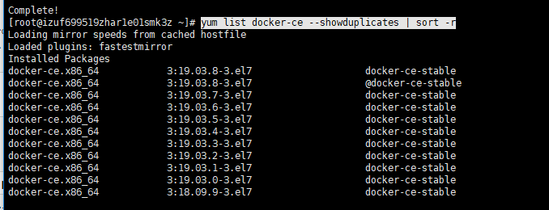

### ## Centos系统安装Docker

在Centos系统安装Docker环境

<!--more-->

这里使用的是Centos7系统，
首先确保旧版本没有残余。

**卸载旧版本**

```shell
sudo yum remove docker \
                  docker-client \
                  docker-client-latest \
                  docker-common \
                  docker-latest \
                  docker-latest-logrotate \
                  docker-logrotate \
                  docker-engine
```

**添加Docker所需依赖**

```shell
sudo yum install -y yum-utils \
  device-mapper-persistent-data \
  lvm2	
```

原本的yum是没有docker的，所以需要将docker的repo添加到yum的repo仓库中

**设置安装仓库**

```shell
sudo yum-config-manager \
    --add-repo \
    https://download.docker.com/linux/centos/docker-ce.repo
```

**安装  Docker Engine-Community**

查看可下载版本列表

```shell
yum list docker-ce --showduplicates | sort -r
```



安装命令

```shell
yum install docker-ce-<VERSION_STRING> docker-ce-cli-<VERSION_STRING> containerd.io
```

选择指定的版本，如19.03.8,替代<VERSION_STRING>

```shell
yum install docker-ce-19.03.8 docker-ce-cli-19.03.8 containerd.io
```

也可直接使用默认最新版本安装

```
sudo yum install docker-ce docker-ce-cli containerd.io
```


**启动docker**

```shell
sudo systemctl start docker
```

**运行helloworld确认是否安装成功**

```shell
sudo docker run hello-world
```

**如果启动失败**
可能性1：selinux值问题
解决：执行 `vi /etc/sysconfig/selinux` , 把 `selinux` 属性值改为`disabled`。然后重启系统。

可能性2：没有配置文件
解决：修改docker.service

```shell
vim  /lib/systemd/system/docker.service  
```

docker.service内容

```shell
[Unit]
Description=Docker Application Container Engine
Documentation=https://docs.docker.com
After=network.target docker.socket
Requires=docker.socket


[Service]
Type=notify
EnvironmentFile=/etc/sysconfig/docker
ExecStart=/usr/bin/docker -d $OPTIONS -H fd://
LimitNOFILE=1048576
LimitNPROC=1048576
LimitCORE=infinity
MountFlags=slave

[Install]
WantedBy=multi-user.target
```

再修改/etc/sysconfig/docker，不存在则新建

```shell
vim /etc/sysconfig/docker 
```
docker内容如下

```shell
# /etc/sysconfig/docker

# Modify these options if you want to change the way the docker daemon runs
OPTIONS='-H tcp://0.0.0.0:4243 -H unix:///var/run/docker.sock'
DOCKER_CERT_PATH=/etc/docker

# If you want to add your own registry to be used for docker search and docker
# pull use the ADD_REGISTRY option to list a set of registries, each prepended
# with --add-registry flag. The first registry added will be the first registry
# searched.
# ADD_REGISTRY='--add-registry registry.access.redhat.com'

# If you want to block registries from being used, uncomment the BLOCK_REGISTRY
# option and give it a set of registries, each prepended with --block-registry
# flag. For example adding docker.io will stop users from downloading images
# from docker.io
# BLOCK_REGISTRY='--block-registry'

# If you have a registry secured with https but do not have proper certs
# distributed, you can tell docker to not look for full authorization by
# adding the registry to the INSECURE_REGISTRY line and uncommenting it.
 INSECURE_REGISTRY='--insecure-registry dl.dockerpool.com:5000'

# On an SELinux system, if you remove the --selinux-enabled option, you
# also need to turn on the docker_transition_unconfined boolean.
# setsebool -P docker_transition_unconfined 1

# Location used for temporary files, such as those created by
# docker load and build operations. Default is /var/lib/docker/tmp
# Can be overriden by setting the following environment variable.
# DOCKER_TMPDIR=/var/tmp

# Controls the /etc/cron.daily/docker-logrotate cron job status.
# To disable, uncomment the line below.
# LOGROTATE=false
```
重启docker

```shell
systemctl daemon-reload
systemctl restart docker
```
